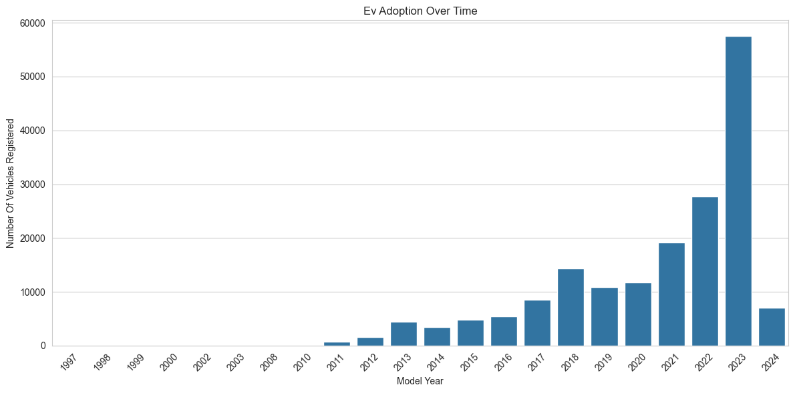
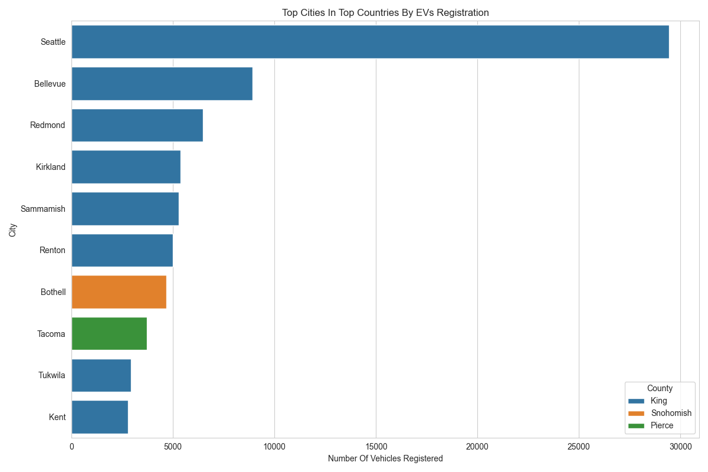
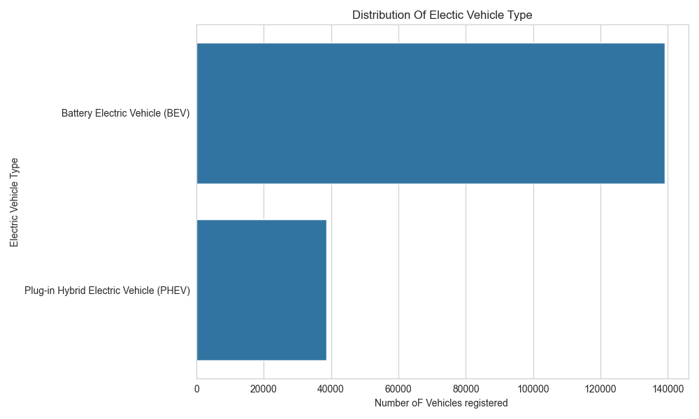
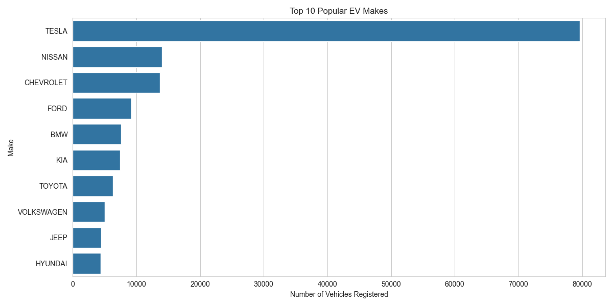
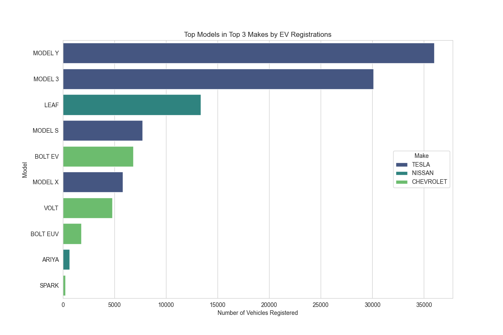
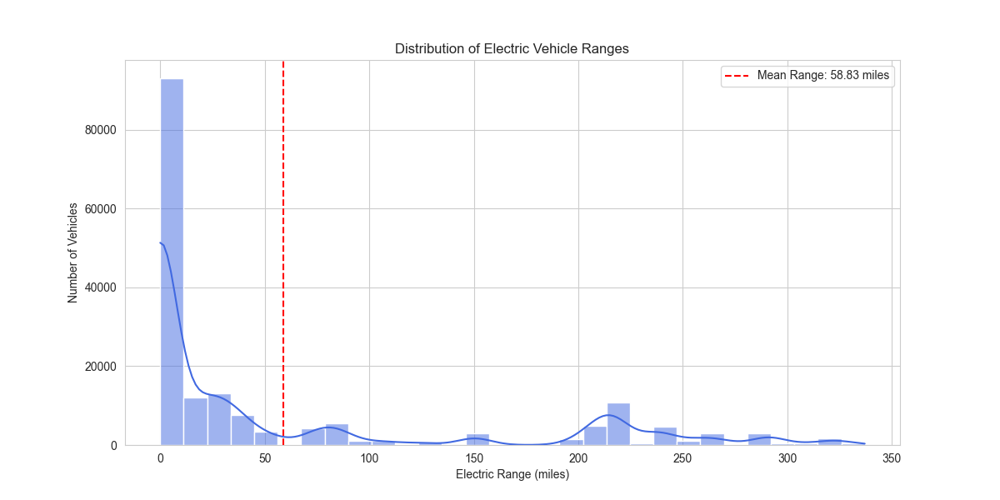
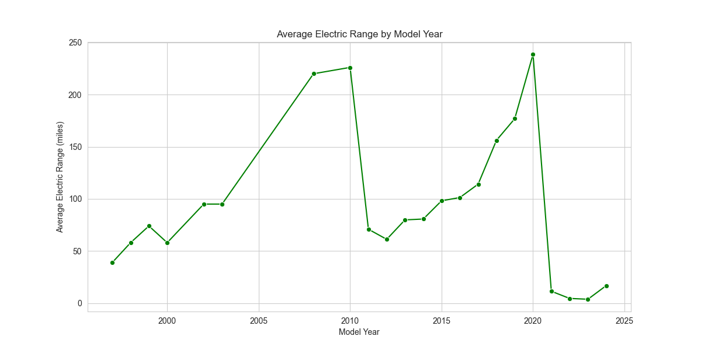
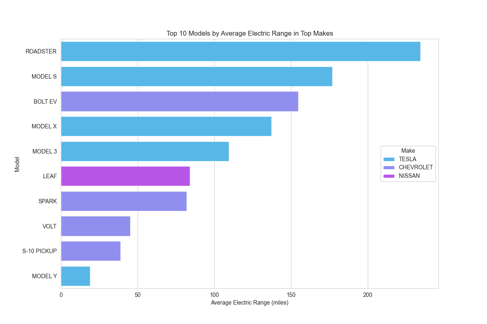

# Electric-Vehicle-Market-Size-Analysis-Using-Python

 Import Dataset AND Load It 
 Analyze the Columns Of Dataset And The Data Type Of Columns 
  Check The Null Cell Counts In The dataset 
 Remove The Null Cells Counts  
 Import Libraries For data Visualization  
 
 Problem Statements 
 Statement 1:Electic Vehicle Adoption Over Time
 
 Statement 2:Top Cities In Top Countries By EVs Registration 
 
 Statement 3:Analyzing The Distributuion Of electrc Vehicle Types 

 Statement 4:analyzing the popularity of EV manufacturers 

 Statement 5:Top Models in Top 3 Makes by EV Registrations 

 Statement 6:Distribution of Electric Vehicle Ranges 

 Statement 7:Average Electric Range by Model Year 

 Statement 8:Top 10 Models by Average Electric Range in Top Makes 

